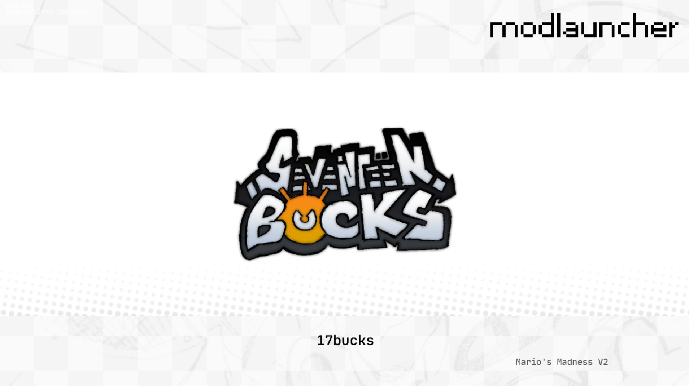

# modlauncher

ingame launcher for fnf mod states

## Overview

Just drag `modlauncher.zip` into your mods folder and you're good to go!

When in the main menu, press `TAB` to open the launcher UI and your `BACK` key to close it. While it's open, you'll see banners of any mods that have bound to the launcher. You can navigate between them with your `UI_LEFT` and `UI_RIGHT` keys, and press your `ACCEPT` key to "launch" the selected mod. You can also cancel the selection by pressing `BACK` before the state transition starts.

## Dependencies

- [cynlib (2.x-3.x)](https://github.com/cyn0x8/cynlib/releases)

## Screenshots




## For developers

The following documentation is also available in the `modlauncher.Registry` code, but here it is for your convenience:

To bind your mod, you must call `bind` from the `modlauncher.Registry` module and pass in an anonymous struct which requires the following fields of `LauncherData`:

|Field|Type|Description|
|-|-|-|
|`name`|`String`|The name of your mod as it will appear in the launcher.|
|`target`|`String`|Full class name of the `ScriptedMusicBeatState` you want to open after your mod is selected. For example, `"exampleMod.states.InitState"`.|
|`logoPath`|`String`|The path to your mod's logo (will be passed into `Paths.image`).<br>Defaults to the modlauncher icon.|
|`selectSoundPath`|`Null<String>`|The path to your mod's select sound (will be passed into `Paths.sound`).<br>Defaults to `"confirmMenu"`.|
|`selectDuration`|`Null<Float>`|The time in seconds from when the player selcts your mod to the end of the state transition, minimum `1.5`.<br>The selection is cancellable until `0.5` seconds before this duration (when the state transition starts).<br>Defaults to `1.5`.|
|`onSetup`|`Null<(LauncherData)->Void>`|Callback to run when modlauncher is injected into the main menu.<br>Useful for setting up your mod banner in the launcher.|
|`onUpdate`|`Null<(LauncherData, Float)->Void>`|Callback to run every frame while the launcher is open.<br>Useful for animating your banner<br>The 2nd parameter is delta-time in seconds.|
|`onFocus`|`Null<(LauncherData)->Void>`|Callback to run when your mod is "focused" on.|
|`onUnfocus`|`Null<(LauncherData)->Void>`|Callback to run when another mod is focused on away from yours.|
|`onSelect`|`Null<(LauncherData)->Void>`|Callback to run when your mod is initially selected, before the state transition starts.|
|`onCancel`|`Null<(LauncherData)->Void>`|Callback to run when your mod selection is cancelled before the state transition starts.|
|`onInit`|`Null<(LauncherData)->Void>`|Callback to run after your mod is selected, and right before your target state is initialized.<br>Useful for "initializing" your mod if you're not using an initialization state (I recommend the latter, though).|

The `LauncherData` parameter passed into the callbacks is the same as the struct you passed into `bind`, but with a few more fields used for the banner:

|Field|Type|Description|
|-|-|-|
|`camera`|`FunkinCamera`|The camera of your mod's banner in the launcher.|
|`groupBG`|`FlxTypedSpriteGroup`|The background group of your mod's banner.|
|`groupUI`|`FlxTypedSpriteGroup`|The UI group of your mod's banner.|
|`logo`|`FunkinSprite`|The logo sprite of your mod's banner, part of `groupUI`.|

So, if you add to this struct in one of your callbacks, it will carry over into the other callbacks.

---

Example binding:

```haxe
package exampleMod;

import flixel.tweens.FlxEase;
import flixel.tweens.FlxTween;

import funkin.graphics.FunkinSprite;
import funkin.modding.module.ModuleHandler;
import funkin.modding.module.ScriptedModule;

class LauncherBinding extends ScriptedModule {
	public function new() {
		super("exampleMod.LauncherBinding");
	}
	
	override public function onCreate(event:ScriptEvent):Void {
		tryBind();
	}
	
	private function tryBind():Void {
		var launcher:Null<ScriptedModule> = null;
		
		if ((launcher = ModuleHandler.getModule("modlauncher.Registry")) != null) {
			launcher.scriptCall("bind", [{
				name: "Example Mod",
				
				target: "exampleMod.states.InitState",
				
				logoPath: "exampleMod/logo",
				
				selectSoundPath: "exampleMod/launcherSelectSound",
				selectSoundLength: 2.5,
				
				onSetup: function(data:Dynamic):Void {
					data.camera.bgColor = 0xff808080;
					
					data.logo.scale.set(0.5, 0.5);
					data.logo.updateHitbox();
					
					var mySprite:FunkinSprite = new FunkinSprite().loadTexture("exampleMod/mySprite");
					data.groupBG.add(mySprite);
					data.mySprite = mySprite;
				},
				
				onSelect: function(data:Dynamic):Void {
					data.camera.flash(0xffffffff, 0.5, null, true);
					
					FlxTween.globalManager.cancelTweensOf(data.logo.scale, ["x", "y"]);
					data.logo.scale.set(0.45, 0.45);
					FlxTween.tween(data.logo.scale, {x: 0.75, y: 0.75}, 1.5, {ease: FlxEase.expoOut});
				},
				
				onCancel: function(data:Dynamic):Void {
					FlxTween.globalManager.cancelTweensOf(data.logo.scale, ["x", "y"]);
					FlxTween.tween(data.logo.scale, {x: 0.5, y: 0.5}, 0.5, {ease: FlxEase.expoOut});
				},
				
				onUpdate: function(data:Dynamic, elapsed:Float):Void {
					data.mySprite.angle += 90 * elapsed;
				},
				
				onInit: function(data:Dynamic):Void {
					ModuleHandler.getModule("exampleMod.Globals").scriptSet("myVariable", true);
				}
			}]);
		}
		
		// Bind to other FNF mod launchers as well? Up to you...
		
		ModuleHandler.getModule("cynlib.reloader.Reloader").scriptGet("reloadPre").set("exampleMod.LauncherBinding", {
			callback: "tryBind"
		});
	}
}
```

> [!important]
> Bound mods do not persist through polymod reload! You must re-bind your mods using the `cynlib.reloader.Reloader` module like in the example above.
