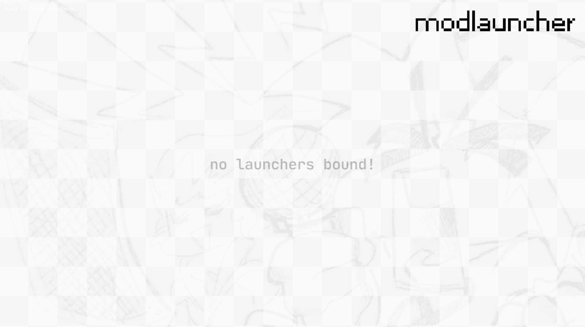
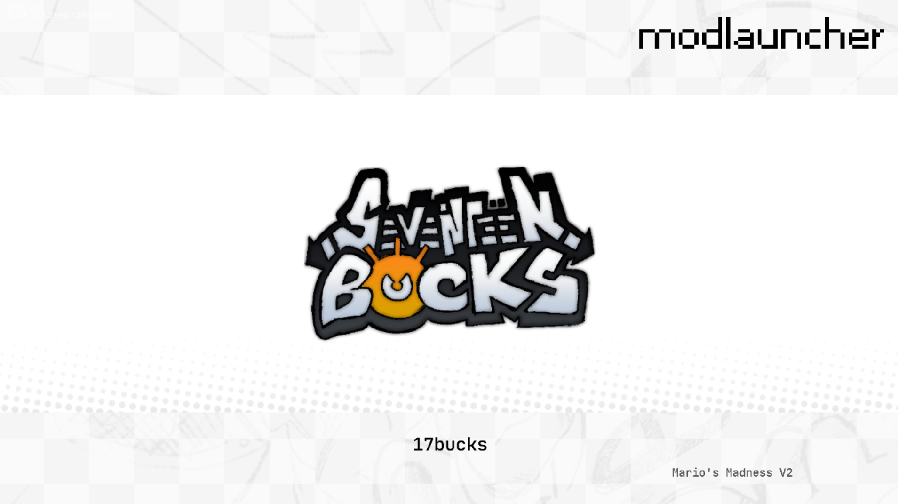

# modlauncher

an ingame launcher for friday night funkin mod states

## overview

just drag `modlauncher.zip` into your mods folder and you're good to go!

when in the main menu, press `TAB` to open the launcher ui and your `BACK` key to close it

in the launcher, you will see banners of any mods that have bound to the launcher

you can navigate between them with your `UI_LEFT` and `UI_RIGHT` keys, and press your `ACCEPT` key to "launch" the selected mod

you can also cancel the selection by pressing `BACK` before the state transition starts

## screenshots





## for developers

to bind your mod, you must call `bind` from the `MODLAUNCHER_Registry` module and pass in a single struct with the following fields:

|field|type|description|
|-|-|-|
|`name`|`String`|the name of your mod as it will appear in the launcher|
|`target`|`String`|class name of the `ScriptedMusicBeatState` you want to open|
|`logo_path`|`String`|the path to your mod's logo (will be passed into `Paths.image`)<br>defaults to the modlauncher icon|
|`select_sound_path`|`Null<String>`|the path to your mod's select sound (will be passed into `Paths.sound`)<br>defaults to `"confirmMenu"`|
|`select_duration`|`Null<Float>`|the time in seconds from when the player selcts your mod to the end of the state transition, minimum `1.5`<br>the selection is cancellable until `0.5` seconds before this duration (when the state transition starts)<br>defaults to `1.5`|
|`on_setup`|`Null<(Dynamic)->Void>`|callback to run when modlauncher is injected into the main menu, useful for setting up your mod banner in the launcher|
|`on_update`|`Null<(Dynamic, Float)->Void>`|callback to run every frame while the launcher is open, useful for animating your banner<br>the 2nd parameter is delta time in seconds|
|`on_focus`|`Null<(Dynamic)->Void>`|callback to run when your mod is "focused" on|
|`on_unfocus`|`Null<(Dynamic)->Void>`|callback to run when another mod is focused on away from yours|
|`on_select`|`Null<(Dynamic)->Void>`|callback to run when your mod is selected|
|`on_cancel`|`Null<(Dynamic)->Void>`|callback to run when your mod selection is cancelled before the state transition starts|
|`on_init`|`Null<(Dynamic)->Void>`|callback to run after your mod is selected and right before your target state is initialized, useful for "initializing" your mod|

the `Dynamic` parameter passed into the callbacks is the same as the struct you passed into `bind`, but with a few more fields used for the banner:

|field|type|description|
|-|-|-|
|`cam`|`FunkinCamera`|the camera of your mod's banner in the launcher|
|`bg_group`|`FlxTypedSpriteGroup`|bg group for your mod's banner|
|`ui_group`|`FlxTypedSpriteGroup`|ui group for your mod's banner|
|`logo`|`FunkinSprite`|the logo of your mod, part of `ui_group`|

if you modify this parameter, it will carry over into the callbacks

---

example binding:

```haxe
import flixel.FlxG;
import flixel.tweens.FlxEase;
import flixel.tweens.FlxTween;

import funkin.modding.module.ModuleHandler;
import funkin.modding.module.ScriptedModule;

class MyMod_LauncherBinding extends ScriptedModule {
	public function new() {
		super("MyMod_LauncherBinding");
	}
	
	override public function onCreate(event:ScriptEvent):Void {
		try_bind();
	}
	
	private function try_bind():Void {
		var launcher:Null<ScriptedModule> = null;
		
		if ((launcher = ModuleHandler.getModule("MODLAUNCHER_Registry")) != null) {
			launcher.scriptCall("bind", [{
				name: "My Mod",
				
				target: "MyMod_InitState",
				
				logo_path: "my_mod/logo",
				
				select_sound_path: "my_mod/launcher_select",
				select_sound_length: 2.5,
				
				on_setup: function(data:Dynamic):Void {
					data.cam.bgColor = 0xff808080;
					
					data.logo.scale.set(0.5, 0.5);
					data.logo.updateHitbox();
				},
				
				on_select: function(data:Dynamic):Void {
					data.cam.flash(0xffffffff, 0.5, null, true);
					
					FlxTween.globalManager.cancelTweensOf(data.logo.scale);
					data.logo.scale.set(0.45, 0.45);
					FlxTween.tween(data.logo.scale, {x: 0.75, y: 0.75}, 1.5, {ease: FlxEase.expoOut});
				},
				
				on_cancel: function(data:Dynamic):Void {
					FlxTween.globalManager.cancelTweensOf(data.logo.scale);
					FlxTween.tween(data.logo.scale, {x: 0.5, y: 0.5}, 0.5, {ease: FlxEase.expoOut});
				}
				
				on_init: function(data:Dynamic):Void {
					ModuleHandler.getModule("MyMod_Globals").scriptSet("my_variable", true);
				}
			}]);
		}
		
		// bind to other fnf mod launchers/managers maybe? up to you
		
		FlxG.signals.postStateSwitch.addOnce(function():Void {
			try_bind();
		});
	}
}
```

> [!note]
> bound mods do not persist through polymod reload! you must re-bind your mods on post state switch